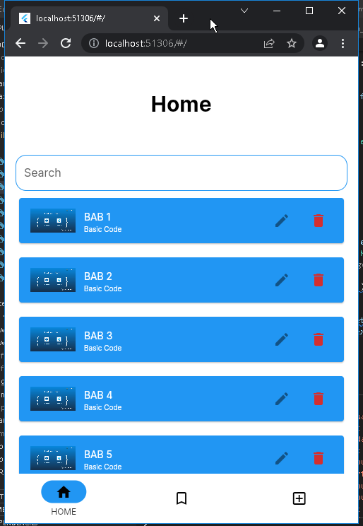
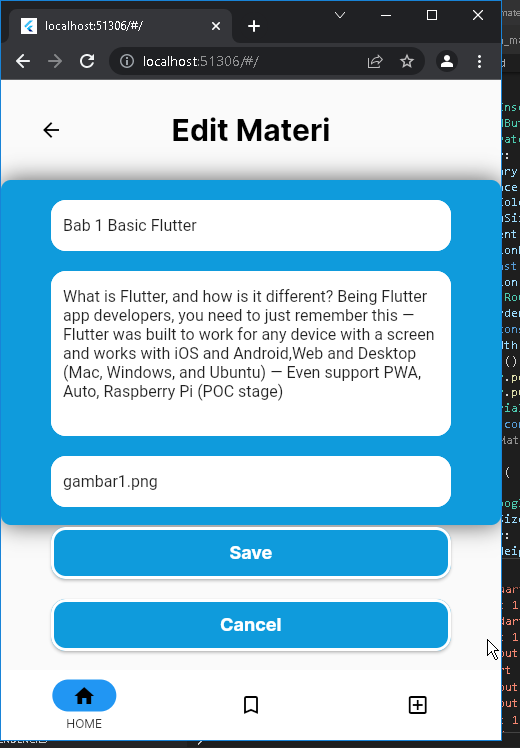

# Proyek Ujian Tengah Semester

Nama Kelompok H-1

Kelas : MI-2F

Anggota:
M. AFADA NUR SAIVA SYAHIRA (2031710168)
MOH. IQBAL WALDAN (2031710139)
MUHAMMAD ZAKI (2031710106)

## Figma

https://www.figma.com/file/dNaxEE5ovMt5RFeHJsXamm/UI-Aplikasi-Modul-Flutter?node-id=0%3A1

## Halaman Pilihan

## Halaman Login

## Halaman Forgot Password

## Halaman Register

## Halaman Home

## Halaman Bookmark

## Halaman Add

## Halaman Materi

## Fitur Delete

## Halaman Edit Materi

